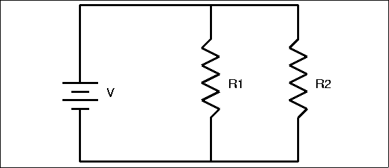

# Physics-EOY-Project
**Circuit Simulator**

By: Henry Abrahamsen, Nate Dienes, and Teawoo Kim.

**Overview:**

We have created a web page to simulate a circuit as created by the user. We used the p5js library to create a canvas containing the visuals. The search and solve algorithms are done in plain js, and the matrix math is done using numeric.js. At the moment, the simulator will only work for circuits with elements in series. When solving for circuits in parallel, the direction of the current and the direction of traversal changes in different loops, and all attempts to account for this change have not yet worked. This results in some currents in Kirchhoff's current law equations being added instead of subtracted or vice-versa. Which obviously ends up calculating incorrect current values.

This simulation includes capabilities for resistors, batteries, wires, and capacitors. Note that the capacitors are only approximated based on the `dt` value. The elements can be added to the circuit using the html buttons at the top. These buttons create a standard version of their associated element. Each element can be created with a `value` between 0.1 and 10. The element created will have an attribute value associated with the slider. For resistors, it's resistance, capacitors: capacitance, inductors: inductance (note that inductors aren't currently implemented), and batteries: voltage. As the desired circuit is created, the simulator will (in real time) update the current values.

**Running code:**

To run this program, download the project zip file from GitHub, [https://github.com/hen1227/Physics-EOY-Project/archive/refs/heads/main.zip](https://github.com/hen1227/Physics-EOY-Project/archive/refs/heads/main.zip). Unzip the folder and open the index.html file with a web browser. That should be all that is required. Note: this requires a network connection to load external libraries. You'll also be able to access all of the raw commented code in the downloaded folder as well as the GitHub page.

**Calculating current:**

To calculate the current, we decided to use Kirchhoff's Laws to set up a matrix with the current coefficients and set that equal to the loop's voltage values. The idea is that if we give the algorithm all of the various equations for various loops (even extraneous ones), a math library could solve the overdetermined matrix, giving us the current values. This approach is the one that has the most potential for the complete final product, although it is exceptionally challenging to implement. Our approach had a couple of difficulties. First, we had to traverse through all the connecting circuit elements and get a list of unique paths leading from one end of the battery to another. For circuits in series, there is only one loop and this approach is much more complicated than it needs to be. However, knowing these paths is crucial in order to manage elements in parallel. To do determine these paths, we implemented a Depth-First Search (DFS)[^1].

Once we had every path, we added the resistance in each current and assigned it the corresponding column in the matrix. Each path was a row in the matrix, and every column represented a current ID, or the current through a specific part of the circuit. Initially, we assigned the same current IDs to elements that should have the same current values, but eventually, we realized it was easier not to keep track of that and instead added an extra Kirchhoff current law of sorts to set the two ID values equal. This allowed us to add more equations to the algorithm depending on if two elements were in series or parallel. As a result, we had many more rows than columns because some equations were being added twice. The matrix was still solvable but it required singular value decomposition [^2] to reduce the redundant equations.

In many cases, the loop rules alone are not enough to solve a circuit. We added additional equations to the matrix to represent currents adding up or being equivalent, representing the junction rule or simply the relationship between currents in parallel or series.

Figure 1.

For example, in the circuit in Figure 1, call the current through the battery . The currents through R1 and R2 are and respectively. This circuit yields the following matrix:

[[0, R1, 0], [ V,

[0, 0, R2], = V,

[1, -1, -1] 0,

[-1, 1, 1]] 0]

The values in the matrix are the _coefficients_ of the current values we are calculating, and in the other matrix with the "answers" includes the voltage calculated separately using the EMF of batteries involved. For example, The equation [-1, 1, 1] = 0 represents . Also note that this equation is redundant. This is because the intersection is met in both loops and accounted for twice, however this system of equations is still solvable, and as long as the equations don't contradict each other, we'll get the same result.

If we had two elements in series, their currents would be set equal so we would have = [1, -1, 0] = 0.

The math library, numeric js, solves this overdetermined system, with both the Kirchhoff's current equations and loop rule equations to give us the current values. While the current circuit simulator only works for currents in series, our approach allows for the extension of parallel circuits as well. This is _not_ the simplest way to solve a circuit if it is known to be exclusively one loop, but we hope to eventually be able to expand this simulator to parallel circuits as well.

[^1]: https://medium.com/omarelgabrys-blog/path-finding-algorithms-f65a8902eb40

[^2]: https://en.wikipedia.org/wiki/Singular\_value\_decomposition
